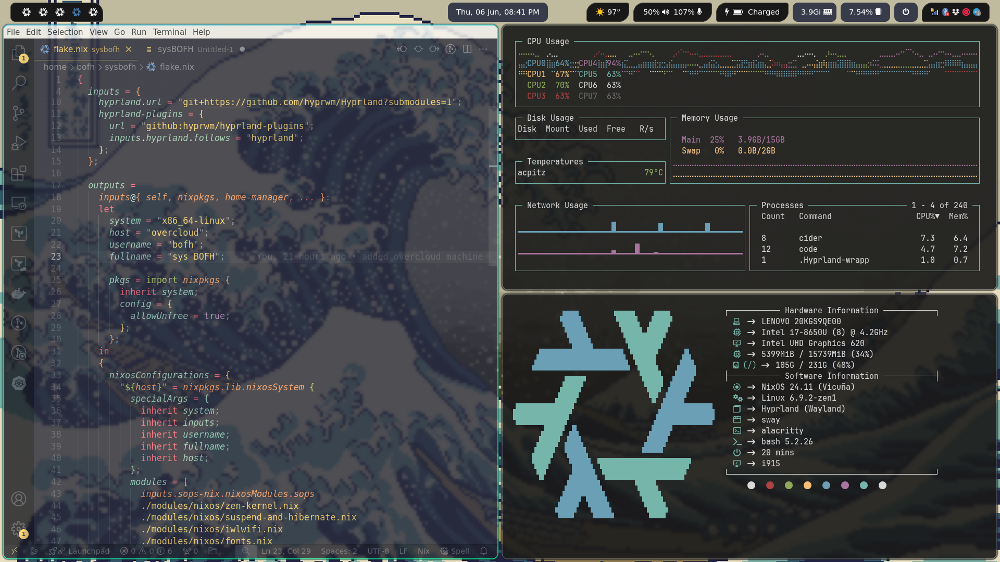
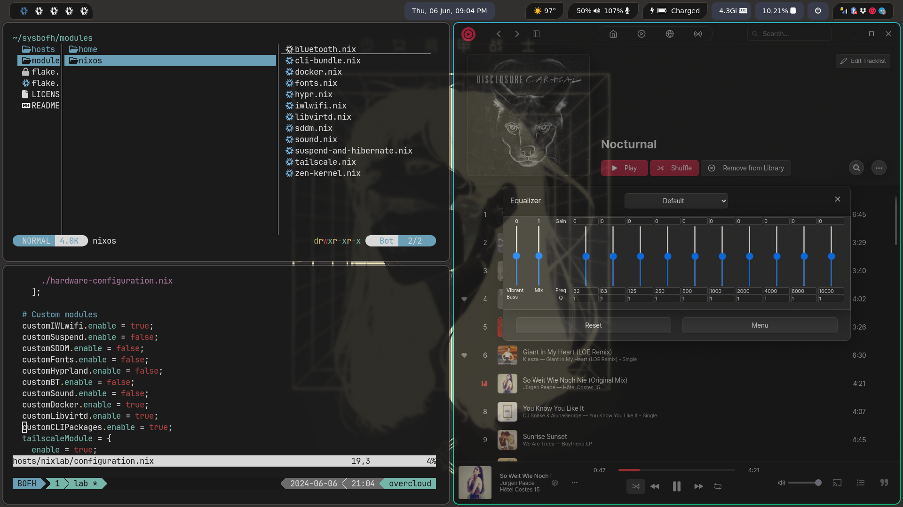

 <h1 id="header" align="center">
  
  <br>
  sysBOFH
</h1>

<h2 align="center">My NixOS Configuration</h2>

<div align="center">

[](https://nixos.org)
[](https://nixos.org)
[](https://github.com/zen-kernel/zen-kernel)
[](https://hyprland.org/)
[](https://hydra.billy.sh/jobset/sysBOFH/sysbofh#tabs-jobs)

</div>

## Index

- [About](#About)
- [Structure](#Structure)
- [Screenshots](#Screenshots)
- [NixVim](#NixVim)
- [Contact](#Contact)
- [License](#License)

## About

### sysBOFH Project

- After using Nixos for a while on my main laptop, **I achieved a functional system tailored to me**, so much so that I wanted to replicate it on all the machines I use, so finally [flakes](https://nixos.wiki/wiki/Flakes) made sense.
- I'm using [NixOS](https://nixos.org/) [unstable](https://channels.nixos.org/?prefix=nixos-unstable/) with [home-manager](https://nixos.wiki/wiki/Home_Manager) (_standalone installation_) mostly for manage my dotfiles and keep my packages and services system-wide with the main _configuration.nix_
- I still keep all my dotfiles in original format, I have not rewritten them in nix syntax for two reasons: compatibility and laziness
- Lately I migrated to [Flakes](https://nixos.wiki/wiki/Flakes) from [Nix Channels](https://nixos.wiki/wiki/Nix_channels) so I try to keep my scheme and modules as simple as possible following the [KISS](https://en.wikipedia.org/wiki/KISS_principle) principle

### High level overview

- [SDDM](https://github.com/sddm/sddm) Login Manager with my custom ([BOFH Theme](https://github.com/wverac/bofh-theme-sddm)) version of [tokyo-night-sddm](https://github.com/rototrash/tokyo-night-sddm)
- [Wayland](https://wayland.freedesktop.org/) with [Hyprland](https://hyprland.org/) and [waybar](https://github.com/alexays/waybar)
- [SOPS-Nix](https://github.com/Mic92/sops-nix) as secrets management scheme
- [zen-kernel](https://github.com/zen-kernel/zen-kernel) in my main-personal machine

## Structure

```
sysbofh/
├── hosts
│   ├── nixlab
│   └── sysbofh
├── modules
│   ├── home
│   │   └── config
│   │       ├── alacritty
│   │       ├── dunst
│   │       ├── fastfetch
│   │       ├── feh
│   │       ├── hypr
│   │       │   └── scripts
│   │       ├── rofi
│   │       ├── waybar
│   │       │   └── scripts
│   │       └── wlogout
│   │           └── icons
│   └── nixos
└── screenshots
```

- [hosts](hosts) Custom settings for each machine I use
  - [nixlab](hosts/nixlab) Beelink S12 Pro Mini PC
  - ~~[overcloud](hosts/overcloud) ThinkPad X1 Carbon 6th~~
  - [sysbofh](hosts/sysbofh) System76 Lemur Pro
  - ~~[work](hosts/work) ThinkPad X1 Yoga Gen 6~~
  - [m4nix](hosts/minix) Apple M4 Pro
- [modules](modules) Modularized NixOS configurations
  - [home](modules/home) home-manager configurations
    - [config](modules/home/config) Programs dotfiles, themes and configurations
- [nixos](modules/nixos) OS-wide configurations and settings

## Screenshots





## NixVim

Yes, I made my NixVim distro, it's simple, it's functional, there are no thousand configuration files, it's fast and it's beautiful.  
https://github.com/wverac/nixvim

```nix
nix run github:wverac/nixvim
```

## Contact

`wv@linux.com`

## License

This project is licensed under the MIT License - see the [LICENSE](LICENSE) file for details.
